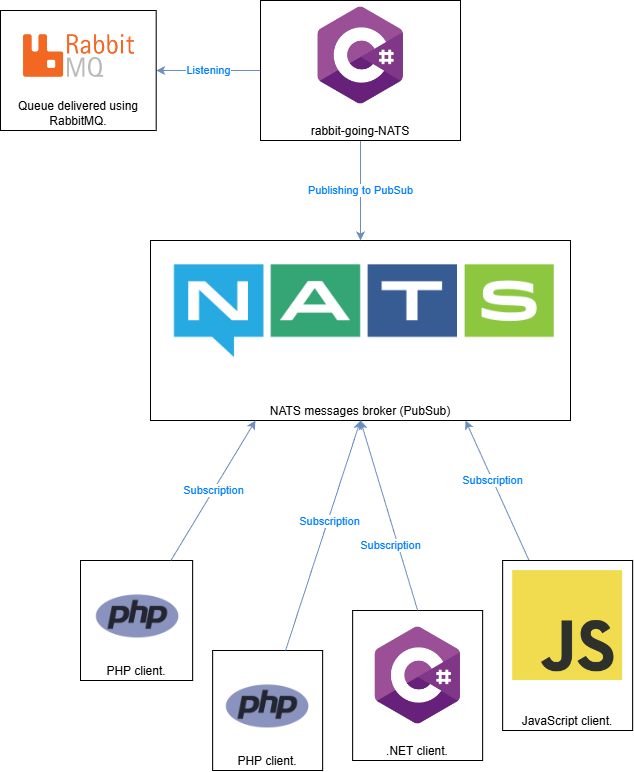

Rabbit-Going-NATS
=================

Tool which allows to passthrough messages fetched from RabbitMQ's queue to NATS
PubSub. Useful if you receive a data feed through RabbitMQ, but you need to
redistribute it further to multiple clients in the most efficient way.

Learn more why NATS is the way to go: https://idct.tech/articles/going-nats

Allows to create an infrastructure as in the diagram below:



# Installation

Application supports any .NET compatible environment. May be executed as .NET
CLR application with .NET 8+ Runtime or precompiled to a standalone native
binary using the NativeAOT functionality.

Repository features two precompiled applications:
* Native Linux AMD64 (as this is the most popular environment)
* Native Linux ARM64 (as this is my environment)

You may compile for your environment using simply `dotnet publish` command.

To run the application just:
1) compile yourself or download the binary from latest Release.
2) place the binary in a desired folder.
3) create appsettings.json as instructed below.

NOTE: I personally suggest to run this using **supervisor** to be sure it gets
restarted in case of any failure.

# Configuration

Application expects configuration sections file to be present in the config file,
standard `appsettings.json` in the workdir:

```json
{
    "RabbitMq": {
        "HostName": "localhost",
        "UserName": "user",
        "Port": 5000,
        "Password": "password",
        "VirtualHost": "",
        "QueueName": "test"
    },
    "Nats": {
        "Url": "nats://localhost:4222",
        "Subject": "test-subject",
        "Secret": "s3cr3t"
    }
}
```

You may also use username and password:
```json
{
    "Nats": {
        "Url": "nats://localhost:4222",
        "Username": "<your username>",
        "Password": "<your password>"
    }
}
```
`VirtualHost` defaults to "/".
If your NATS server does not have any protection leave `Secret` and `Username`/`Password` fields empty.

This file may be used also to set config details for Nlog Logging.

For example adding there:
```json
{
  "Logging": {
      "NLog": {
          "IncludeScopes": false,
          "ParseMessageTemplates": true,
          "CaptureMessageProperties": true
      }
  },
  "NLog": {
      "autoreload": true,
      "internalLogLevel": "Debug",
      "internalLogFile": "/var/log/rabbit-going-nats.log",
      "throwConfigExceptions": true,
      "targets": {
          "console": {
              "type": "Console",
              "layout": "${date}|${level:uppercase=true}|${message} ${exception:format=tostring}|${logger}|${all-event-properties}"
          },
          "file": {
              "type": "AsyncWrapper",
              "target": {
                  "wrappedFile": {
                      "type": "File",
                      "fileName": "/var/log/rabbit-going-nats.log",
                      "layout": {
                          "type": "JsonLayout",
                          "Attributes": [
                              { "name": "timestamp", "layout": "${date:format=o}" },
                              { "name": "level", "layout": "${level}" },
                              { "name": "logger", "layout": "${logger}" },
                              { "name": "message", "layout": "${message:raw=true}" },
                              { "name": "properties", "encode": false, "layout": { "type": "JsonLayout", "includeallproperties": "true" } }
                          ]
                      }
                  }
              }
          }
      },
      "rules": [
          {
              "logger": "*",
              "minLevel": "Trace",
              "writeTo": "File,Console"
          }
      ]
  }
}
```

Will cause logging of everything in Debug mode to
`/var/log/rabbit-going-nats.log`.

NOTE: Be sure to set permissions to the log file, user which runs the
application must be able to write to it.

You may use different Nlog targets, be sure to check Nlogs config reference:
https://nlog-project.org/config/

Warning: this build includes Sentry.IO logging target support.

# Any form of testing at the moment?

If you have Docker installed you may launch first:

1. `setup-test.sh` which will create an instance of RabbitMQ, queue and NATS.
2. build: `dotnet publish`
3. run the binary with config from `appsettings.json.dist` (place it in the same
folder and rename ot appsettings.json).
4. execute `run-test.sh` which will send few messages to the queue.

Proper tests are in the TODOs.

# TODO

* Unit Tests.
* Functional tests.
* Utilize the stopping token.
* Support multiple sources.
* Support more authorization methods.
* Strip ExecuteAsync into proper sections, submethods, organise code better.
* Option to support scripted events: for example to execute a command or
different application when connection gets regained.

# Contribution

Feel free to create any issues or pull requests, they are more than welcome!

# License and 3rd party software

Application uses:

* NLog from https://www.nuget.org/packages/nLog/ under BSD-3 License.
Copyright (c) 2004-2024 NLog Project - https://nlog-project.org/
Source code has not been altered.

* RabbitMQ.Client from https://www.nuget.org/packages/RabbitMQ.Client/7.0.0-rc.12
under Apache-2.0 OR MPL-2.0 license.
Copyright (c) 2007-2024 Broadcom. All Rights Reserved. The term "Broadcom" refers to Broadcom Inc. and/or its subsidiaries.
Source code has not been altered.

* NATS.Net from https://www.nuget.org/packages/NATS.Net
under Apache-2.0 license
Copyright © The NATS Authors 2016-2024
Source code has not been altered.

* All licenses provided in LICENSES folder.
Copied from: https://licenses.nuget.org/.

Main application Rabbit-Going-Nats is licenses under MIT license.
Creator of the application gives all the credits to the authors of the libraries
used in this software and claims no ownership to those parts.