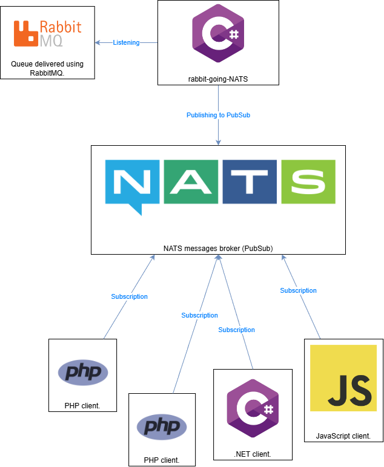

Rabbit-Going-NATS
=================

[](https://github.com/ideaconnect/rabbit-going-nats/actions/workflows/build-binaries.yml)

Tool which allows to passthrough messages fetched from RabbitMQ's queue to NATS
PubSub. Useful if you receive a data feed through RabbitMQ, but you need to
redistribute it further to multiple clients in the most efficient way.

Allows to create an infrastructure as in the diagram below:



# Project Structure

The project is organized into the following structure:

```
rabbit-going-nats/
├── rabbit-going-nats/          # Main application
│   ├── Program.cs               # Application entry point and DI configuration
│   ├── Worker.cs                # Background service for message processing
│   ├── Model/                   # Configuration models
│   │   ├── RabbitMqConnection.cs
│   │   ├── NatsConnection.cs
│   │   ├── WebServiceConfiguration.cs
│   │   └── ApiJsonSerializerContext.cs  # AOT-compatible JSON serialization
│   └── Service/                 # Core services
│       ├── IRabbitMqConnectionHandler.cs
│       ├── RabbitMqConnectionHandler.cs
│       ├── INatsConnectionHandler.cs
│       ├── NatsConnectionHandler.cs
│       ├── IMessageStatisticsService.cs  # Message statistics tracking
│       ├── MessageStatisticsService.cs
│       ├── IWebMonitoringService.cs      # HTTP monitoring service
│       └── WebMonitoringService.cs
├── rabbit-going-nats-tests/     # Test project
│   └── Tests/
│       ├── Integration/          # Integration tests
│       ├── Model/               # Model tests
│       └── Service/             # Service unit tests
└── simple-feature-test/         # End-to-end testing with Docker
    ├── Makefile                 # Automated testing pipeline
    ├── setup-test.sh
    ├── run-test.sh
    └── nats/
        └── nats-server.conf
```

# Installation

Application supports any .NET compatible environment. May be executed as .NET
CLR application with .NET 8+ Runtime or precompiled to a standalone native
binary using the NativeAOT functionality.

Repository features two precompiled applications:
* Native Linux AMD64 (as this is the most popular environment)
* Native Linux ARM64 (as this is my environment)

You may compile for your environment using simply `dotnet publish` command.

To run the application just:
1) compile yourself or download the binary from latest Release.
2) place the binary in a desired folder.
3) create appsettings.json as instructed below.

NOTE: I personally suggest to run this using **supervisor** to be sure it gets
restarted in case of any failure.

# Configuration

Application expects configuration sections file to be present in the config file,
standard `appsettings.json` in the workdir:

```json
{
    "RabbitMq": {
        "HostName": "localhost",
        "UserName": "user",
        "Port": 5000,
        "Password": "password",
        "VirtualHost": "",
        "QueueName": "test"
    },
    "Nats": {
        "Url": "nats://localhost:4222",
        "Subject": "test-subject",
        "Secret": "s3cr3t"
    },
    "WebService": {
        "Enabled": true,
        "Host": "localhost",
        "Port": 8018
    }
}
```

You may also use username and password:
```json
{
    "Nats": {
        "Url": "nats://localhost:4222",
        "Username": "<your username>",
        "Password": "<your password>"
    }
}
```
`VirtualHost` defaults to "/".
If your NATS server does not have any protection leave `Secret` and `Username`/`Password` fields empty.

This file may be used also to set config details for Nlog Logging.

For example adding there:
```json
{
  "Logging": {
      "NLog": {
          "IncludeScopes": false,
          "ParseMessageTemplates": true,
          "CaptureMessageProperties": true
      }
  },
  "NLog": {
      "autoreload": true,
      "internalLogLevel": "Debug",
      "internalLogFile": "/var/log/rabbit-going-nats.log",
      "throwConfigExceptions": true,
      "targets": {
          "console": {
              "type": "Console",
              "layout": "${date}|${level:uppercase=true}|${message} ${exception:format=tostring}|${logger}|${all-event-properties}"
          },
          "file": {
              "type": "AsyncWrapper",
              "target": {
                  "wrappedFile": {
                      "type": "File",
                      "fileName": "/var/log/rabbit-going-nats.log",
                      "layout": {
                          "type": "JsonLayout",
                          "Attributes": [
                              { "name": "timestamp", "layout": "${date:format=o}" },
                              { "name": "level", "layout": "${level}" },
                              { "name": "logger", "layout": "${logger}" },
                              { "name": "message", "layout": "${message:raw=true}" },
                              { "name": "properties", "encode": false, "layout": { "type": "JsonLayout", "includeallproperties": "true" } }
                          ]
                      }
                  }
              }
          }
      },
      "rules": [
          {
              "logger": "*",
              "minLevel": "Trace",
              "writeTo": "File,Console"
          }
      ]
  }
}
```

Will cause logging of everything in Debug mode to
`/var/log/rabbit-going-nats.log`.

NOTE: Be sure to set permissions to the log file, user which runs the
application must be able to write to it.

You may use different Nlog targets, be sure to check Nlogs config reference:
https://nlog-project.org/config/

Warning: this build includes Sentry.IO logging target support.

# Web Monitoring Service

The application includes a built-in HTTP monitoring service that provides real-time statistics about message processing. This lightweight service uses `HttpListener` for minimal overhead.

## Configuration

The web service is configured in the `WebService` section of `appsettings.json`:

```json
{
    "WebService": {
        "Enabled": true,
        "Host": "localhost",
        "Port": 8018
    }
}
```

- `Enabled`: Whether the web service is active (default: `true`)
- `Host`: The hostname to bind to (default: `"localhost"`)
- `Port`: The port to listen on (default: `8018`)

## Available Endpoints

### Health Check
- **GET** `/health`
- Returns service health status
- Response:
  ```json
  {
      "status": "healthy",
      "timestamp": "2025-09-30T10:15:30.123Z",
      "service": "RabbitGoingNats"
  }
  ```

### Message Statistics
- **GET** `/stats` or **GET** `/statistics` or **GET** `/`
- Returns real-time message processing statistics
- Response:
  ```json
  {
      "lastMessageReceived": "2025-09-30T10:15:29.456Z",
      "lastMessageSent": "2025-09-30T10:15:29.458Z",
      "messagesPerMinute": 42,
      "messagesInLastHour": 2520
  }
  ```

## Features

- **Thread-safe**: Concurrent message statistics tracking
- **CORS-enabled**: Accessible from web browsers
- **AOT-compatible**: Uses source generators for optimal performance
- **Rolling statistics**: Automatic cleanup of old data
- **Lightweight**: Uses `HttpListener` for minimal resource usage

## Usage Examples

```bash
# Check service health
curl http://localhost:8018/health

# Get message statistics
curl http://localhost:8018/stats

# Pretty-print JSON response
curl -s http://localhost:8018/stats | jq
```

# Testing

The project includes comprehensive testing infrastructure with multiple test types and automation.

## Test Structure

### Unit Tests
Located in `rabbit-going-nats-tests/Tests/Service/`:
- **MessageStatisticsServiceTests.cs**: Statistics tracking and thread safety
- **WebMonitoringServiceTests.cs**: HTTP service functionality
- **NatsConnectionHandlerTests.cs**: NATS connection and message publishing
- **RabbitMqConnectionHandlerTests.cs**: RabbitMQ connection and consumption
- **WorkerTests.cs**: Background service lifecycle

### Integration Tests
Located in `rabbit-going-nats-tests/Tests/Integration/`:
- **ProgramStartupTests.cs**: Application startup and dependency injection
- **ProgramAdvancedTests.cs**: Advanced configuration scenarios
- **ProgramConfigurationTests.cs**: Configuration validation
- **WebMonitoringIntegrationTests.cs**: End-to-end web service testing

### End-to-End Testing
Automated testing pipeline using Docker containers:

```bash
# Run complete integration test
cd simple-feature-test
make all
```

This will:
1. Build the application
2. Start RabbitMQ and NATS containers
3. Configure test queue and subjects
4. Start the application
5. Test web service endpoints
6. Send test messages and verify forwarding
7. Validate message statistics
8. Clean up containers

## Running Tests

### Unit and Integration Tests
```bash
# Run all tests
cd rabbit-going-nats-tests
dotnet test

# Run with detailed output
dotnet test --verbosity normal

# Run specific test category
dotnet test --filter "Integration"
dotnet test --filter "MessageStatisticsServiceTests"
```

### Manual Testing
If you have Docker installed:

1. **Setup containers**:
   ```bash
   cd simple-feature-test
   ./setup-test.sh
   ```

2. **Build and run**:
   ```bash
   dotnet publish
   # Copy appsettings.json.dist to appsettings.json
   dotnet run
   ```

3. **Send test messages**:
   ```bash
   ./run-test.sh
   ```

4. **Test web endpoints**:
   ```bash
   curl http://localhost:8018/health
   curl http://localhost:8018/stats
   ```

## Test Coverage

The test suite provides comprehensive coverage including:
- ✅ **290 tests** covering all major functionality
- ✅ **Dependency injection** validation
- ✅ **Configuration validation** with invalid scenarios
- ✅ **Message flow** from RabbitMQ to NATS
- ✅ **Statistics tracking** accuracy and thread safety
- ✅ **Web service** HTTP endpoints and responses
- ✅ **Error handling** and edge cases
- ✅ **AOT compatibility** validation

# TODO

* ✅ ~~Unit Tests~~ - **Completed**: 290 comprehensive tests
* ✅ ~~Functional tests~~ - **Completed**: Integration and end-to-end testing
* ✅ ~~Monitoring/Statistics~~ - **Completed**: Web service with real-time stats
* Utilize the stopping token for graceful shutdown
* Support multiple sources (multiple RabbitMQ queues)
* Support more authorization methods (JWT, certificates)
* Support message transformation/filtering
* Option to support scripted events: execute commands on connection events
* Support for message routing based on content
* Metrics export (Prometheus, InfluxDB)

# Contribution

Feel free to create any issues or pull requests, they are more than welcome!

# License and 3rd party software

Application uses:

* NLog from https://www.nuget.org/packages/nLog/ under BSD-3 License.
Copyright (c) 2004-2024 NLog Project - https://nlog-project.org/
Source code has not been altered.

* RabbitMQ.Client from https://www.nuget.org/packages/RabbitMQ.Client/7.0.0-rc.12
under Apache-2.0 OR MPL-2.0 license.
Copyright (c) 2007-2024 Broadcom. All Rights Reserved. The term "Broadcom" refers to Broadcom Inc. and/or its subsidiaries.
Source code has not been altered.

* NATS.Net from https://www.nuget.org/packages/NATS.Net
under Apache-2.0 license
Copyright © The NATS Authors 2016-2024
Source code has not been altered.

* All licenses provided in LICENSES folder.
Copied from: https://licenses.nuget.org/.

Main application Rabbit-Going-Nats is licenses under MIT license.
Creator of the application gives all the credits to the authors of the libraries
used in this software and claims no ownership to those parts.
